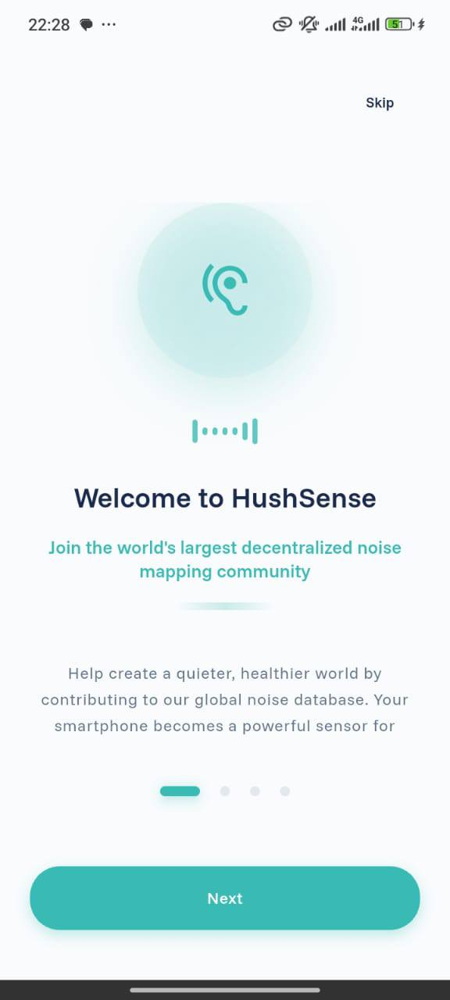
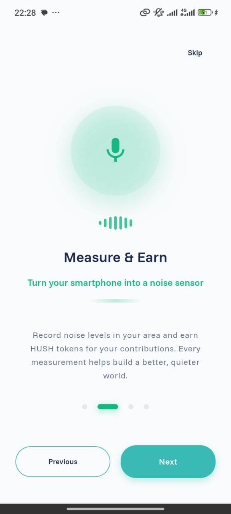
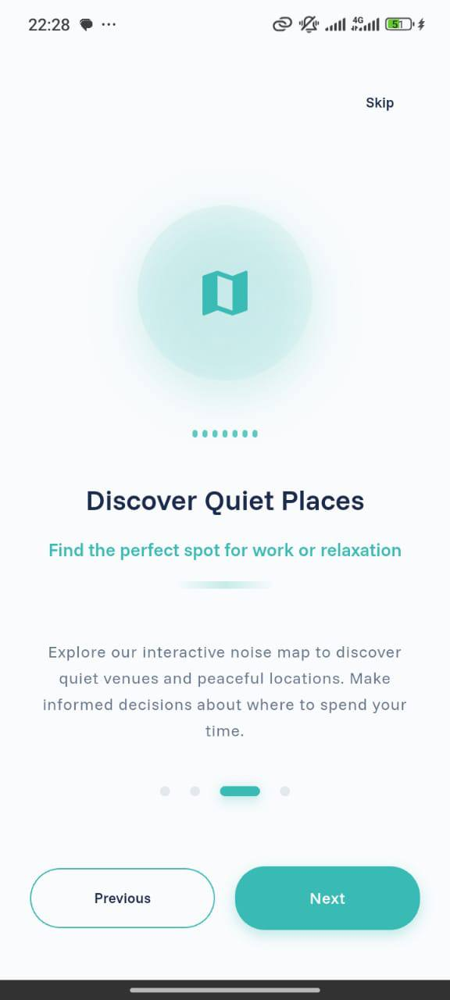
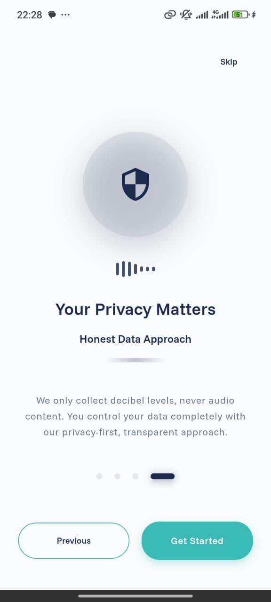
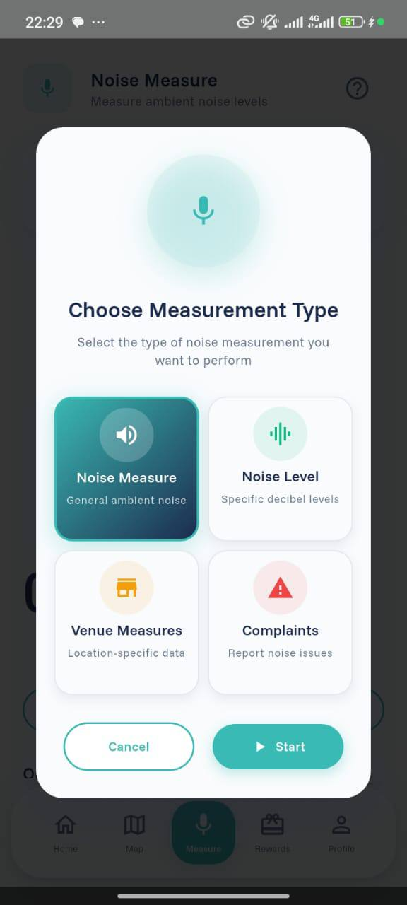
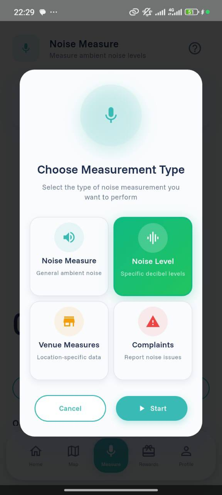
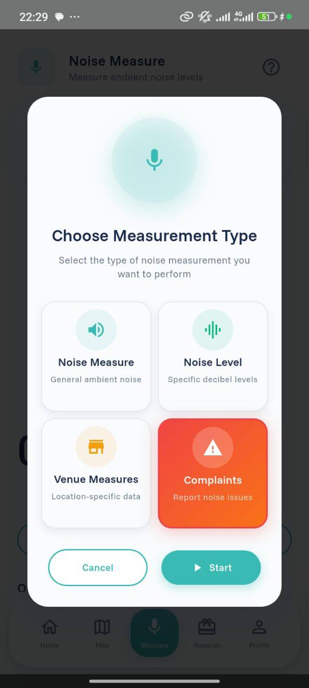

# A Glance of HushSense Software

**User sign-up Page**



<figure><figcaption></figcaption></figure>



<figure><figcaption></figcaption></figure>



<figure><figcaption></figcaption></figure>



### Homepage and Real-Time Noise Map



<figure><figcaption></figcaption></figure>



<figure><figcaption></figcaption></figure>



<figure><figcaption></figcaption></figure>



### Measurement Page&#x20;



<figure><figcaption></figcaption></figure>



<figure><figcaption></figcaption></figure>



<figure><figcaption></figcaption></figure>



### Reward Page with Analytics Page



<figure><figcaption></figcaption></figure>



<figure><figcaption></figcaption></figure>



<figure><figcaption></figcaption></figure>




A User Measuring with a proof of completing



<figure><figcaption></figcaption></figure>



<figure><figcaption></figcaption></figure>



<figure><figcaption></figcaption></figure>



A User Reporting and Measurement History



<figure><figcaption></figcaption></figure>



<figure><figcaption></figcaption></figure>






